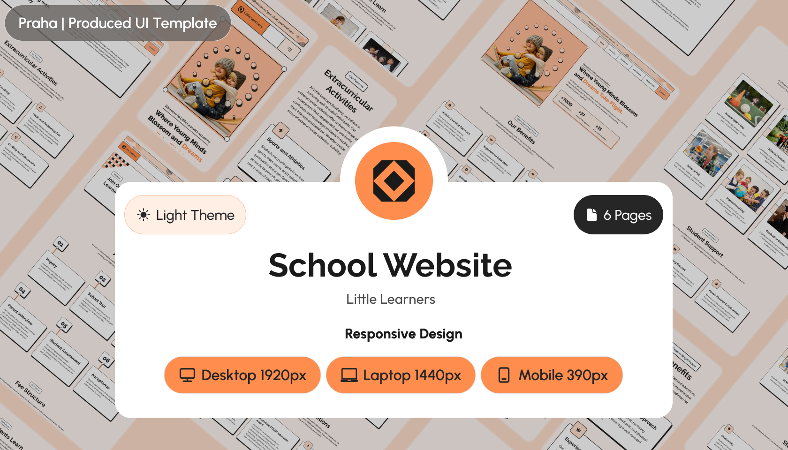

# Web Development Project: Little Learners Website



This website is a **learning project website** I created to test my **web tech** skills. And also for people to see my development skills and experience.

The project will use an already designed project I found on [Figma templates.](https://www.figma.com/community/file/1308633616415979699/school-education-website-ui-template-light-theme-neubrutalism-free-editable)

For the development of this project, I will use the following techstack: [Next.js.](https://nextjs.org/) and [TailwindCSS.](https://tailwindcss.com)

This project is developed under an **open-source software license.** Feel free to comment or send a personal message for details or other information.

_All information presented in this project is fictitious and does not represent real (**valid**) data._

## Build instructions

To install all the software dependencies, run:

```cli
    npm install
```

To build the project for development purposes, starting a local server, run:

```cli
    npm run dev
```

To build the application for production uses, run:

```cli
    npm run build
```

To start a next.js **production server,** run:

```cli
    npm run start
```

I recommend you check the `package.json` file to see more tools, libraries and other CLI commands related to this project.

## Configuration and Environment Variables

This project uses different Environment variables to configure the application functionality. The following list shows each variable along its definition.

_You need to pass the variables so the application can run._

- `GOOGLE_CLIENT_ID`= The Google client ID.
- `GOOGLE_CLIENT_SECRET` = The Google Client Secret.
- `GOOGLE_REFRESH_TOKEN` = The Google refresh token.
- `GOOGLE_REDIRECT_URI` = The Google redirect URI, which is `https://developers.google.com/oauthplayground`
- `GOOGLE_EMAIL` = Your Google email address.
